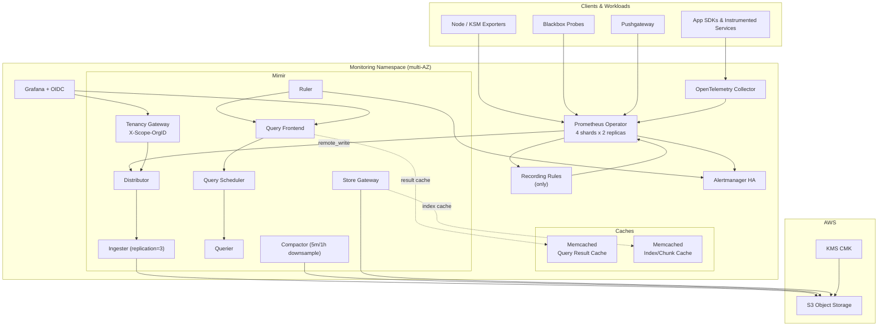

# Monitoring and Alerting Platform

Production-ready infrastructure-as-code for a multi-tenant Prometheus → Mimir stack with HA alerting, Grafana dashboards, and tight cost controls.

## Repository Layout

```
terraform/                # AWS object storage, KMS, IAM
k8s/                      # Kubernetes manifests & Helm values
  grafana/                # Grafana values + dashboards
  mimir/                  # Mimir Helm values & runtime limits
  prometheus-operator/    # Prometheus CRD resources, scrape configs
  alerting/               # Ruler rule groups & Alertmanager values
scripts/                  # Helper scripts (apply, secrets, smoke tests)
```

## Architecture Diagram



## Prerequisites

- Terraform ≥ 1.5 with AWS credentials capable of creating S3, IAM, and KMS resources.
- kubectl ≥ 1.27 with access to your target Kubernetes cluster.
- Helm ≥ 3.12.
- cert-manager and (optionally) an ingress controller in the target cluster.

## Configuration

Create a `.env` file at the repo root or export the following variables before running any scripts:

| Variable | Description |
|----------|-------------|
| `AWS_REGION` | AWS region for S3 + KMS |
| `S3_BUCKET` | Name for the Mimir object storage bucket |
| `KMS_KEY_ID` | KMS CMK ID or ARN securing the bucket |
| `AWS_ACCESS_KEY_ID` / `AWS_SECRET_ACCESS_KEY` | Credentials with access to the bucket/KMS |
| `TENANT_ID` | Default tenant identifier (defaults to `single`) |
| `BASE_DOMAIN` | DNS suffix used by ingress (e.g. `example.com`) |
| `CLUSTER_NAME` | Logical cluster label for metrics (defaults to `primary`) |
| `ENVIRONMENT` | Environment label (defaults to `prod`) |
| `MIMIR_REMOTE_WRITE_TOKEN` | Bearer token used by Prometheus remote write |
| `OIDC_CLIENT_ID` / `OIDC_CLIENT_SECRET` / `OIDC_ISSUER` | Grafana OIDC configuration |
| `GF_ROOT_URL` | External Grafana URL (defaults to `https://grafana.${BASE_DOMAIN}`) |
| `RUNBOOK_BASE_URL` | Base URL for runbooks linked from dashboards (defaults to `https://runbooks.${BASE_DOMAIN}`) |
| `ONCALL_EMAIL` | Primary Alertmanager email target |
| `PD_KEY` | PagerDuty routing key |
| `WEBHOOK_URL` | Generic webhook receiver target |
| `GRAFANA_IAM_ROLE_ARN`, `MIMIR_*_ROLE_ARN` | Optional IRSA role ARNs per component |
| `NODE_EXPORTER_ROLE_ARN`, `KUBE_STATE_METRICS_ROLE_ARN`, `BLACKBOX_EXPORTER_ROLE_ARN` | Optional IRSA role ARNs for exporters |

### Labeling & Service Discovery

- Opt workloads into scraping by labeling namespaces with `monitoring.grafana.com/enabled=true`.
- Classify targets with `monitoring.grafana.com/class` (`app`, `infra`, or `noisy`) so scrape intervals map to the correct budget. Prometheus relabeling injects the `scrape_class` label for guardrails.
- Add optional `monitoring.grafana.com/scope=<team>` to split dashboards or Alertmanager routing by tenant.
- Custom `PodMonitor` rules live under `k8s/prometheus-operator/podMonitors/`; they inherit the above labeling policy.

## Deployment Workflow

1. **Provision AWS primitives**
   ```bash
   cd terraform
   terraform init
   terraform apply
   ```

2. **Generate secrets and runtime config**
   ```bash
   cd ..
   ./scripts/generate_secrets.sh
   ```

3. **Install core exporters**
   ```bash
   helm repo add grafana https://grafana.github.io/helm-charts
   helm repo add prometheus-community https://prometheus-community.github.io/helm-charts

   envsubst < k8s/exporters/node-exporter/values.yaml > /tmp/node-exporter-values.yaml
   helm upgrade --install node-exporter prometheus-community/prometheus-node-exporter \
     -n monitoring -f /tmp/node-exporter-values.yaml

   envsubst < k8s/exporters/kube-state-metrics/values.yaml > /tmp/ksm-values.yaml
   helm upgrade --install kube-state-metrics prometheus-community/kube-state-metrics \
     -n monitoring -f /tmp/ksm-values.yaml

   envsubst < k8s/exporters/blackbox/values.yaml > /tmp/blackbox-values.yaml
   helm upgrade --install blackbox-exporter prometheus-community/prometheus-blackbox-exporter \
     -n monitoring -f /tmp/blackbox-values.yaml
   ```

4. **Install Helm releases (after exporting the same environment variables in your shell)**
   ```bash
   kubectl create namespace monitoring --dry-run=client -o yaml | kubectl apply -f -

    envsubst < k8s/mimir/values.yaml > /tmp/mimir-values.yaml
    helm upgrade --install mimir grafana/mimir-distributed -n monitoring -f /tmp/mimir-values.yaml

   helm upgrade --install prom-operator prometheus-community/kube-prometheus-stack \
     -n monitoring \
     --set grafana.enabled=false \
     --set alertmanager.enabled=false \
     --set kubeStateMetrics.enabled=false \
     --set nodeExporter.enabled=false

   envsubst < k8s/alerting/alertmanager/values.yaml > /tmp/alertmanager-values.yaml
   helm upgrade --install alertmanager prometheus-community/alertmanager \
     -n monitoring -f /tmp/alertmanager-values.yaml

   envsubst < k8s/grafana/values.yaml > /tmp/grafana-values.yaml
   helm upgrade --install grafana grafana/grafana -n monitoring -f /tmp/grafana-values.yaml
   ```

5. **Apply supporting manifests (scrape configs, rules, limits, HPAs)**
   ```bash
   ./scripts/kube_apply.sh
   ```

6. **Run smoke tests**
   ```bash
   ./scripts/smoke_tests.sh
   ```

The smoke test verifies Mimir queries (including long-range downsampled data) and Alertmanager API health.

## Notes

- All manifests expect cert-manager to issue the `monitoring-ca` cluster issuer defined in `k8s/certs/mtls-issuer.yaml`.
- Dashboards are shipped as JSON under `k8s/grafana/dashboards/` and are packaged into ConfigMaps by `scripts/generate_secrets.sh`.
- Terraform-managed S3 lifecycle transitions objects to Standard-IA after 30 days and expires them after 365 days; validate via `terraform plan` or `aws s3api get-bucket-lifecycle-configuration` during DR tests.
- Prometheus remote write token, IAM bindings, and OIDC secrets are intentionally externalised to keep sensitive data out of Git.
- Mutual TLS certificates are minted by cert-manager (`k8s/certs/mtls-issuer.yaml`) and mounted via secrets referenced in the Helm values.
- For multi-tenant operations extend `k8s/mimir/limits.yaml` with additional tenant overrides and re-run `scripts/generate_secrets.sh`.
- Run `./scripts/lint_configs.sh` in CI to promtool-validate recording rules and cardinality guardrails before merging.
- Re-run `./scripts/generate_secrets.sh` after refreshing credentials (remote write token, OIDC client secret, TLS bundles) to rotate secrets safely.
- Capture configuration backups with `./scripts/backup_state.sh` and ship the resulting tarball to durable storage; it includes Grafana dashboards, Alertmanager silences, and ruler rules.
- Autoscaling hints are recorded in `k8s/prometheus-operator/recording-rules/autoscale_signals.yaml` and HPAs live under `k8s/mimir/autoscaling/hpa.yaml`.
- Query limits, tenant quotas, and cache policies are set in `k8s/mimir/values.yaml` and `k8s/mimir/limits.yaml`; adjust per tenant and redeploy the runtime config ConfigMap.
- Synthetic availability probes are managed via the blackbox exporter values (`k8s/exporters/blackbox/values.yaml`) and alerting rules in `k8s/alerting/ruler/rules/blackbox.yaml`.
- Prometheus shards match only rules labeled `monitoring.grafana.com/rule-type=recording`; all alerting logic is owned by the central ruler (`k8s/alerting/ruler/rules`).
- Exemplars are forwarded to Tempo via Grafana's exemplar trace ID mapping; ensure instrumented services emit exemplar data for end-to-end tracing.
- Downsampling (5m/1h) is enabled via the compactor configuration in `k8s/mimir/values.yaml` and surfaced on the Mimir dashboard.
